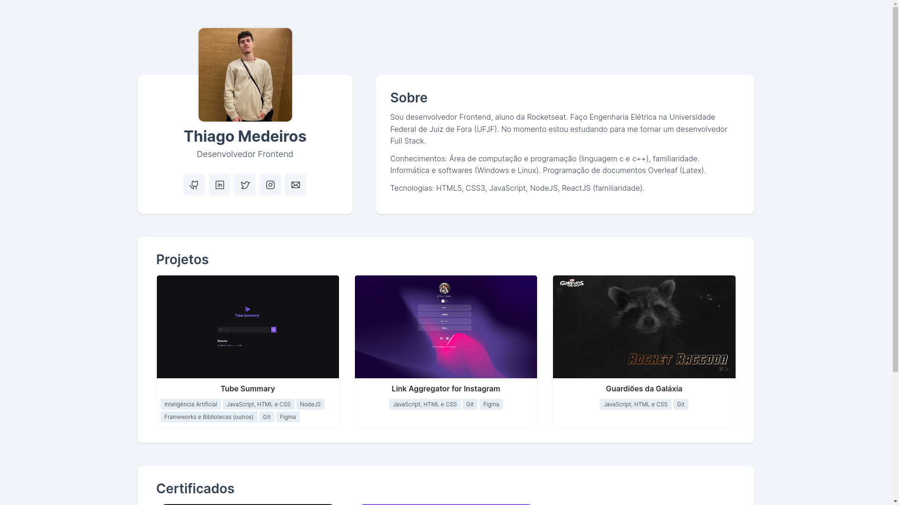

<h1 align="center"> Thiago Medeiros - Portfólio </h1>

Meu portfólio online.  

  <a href="#-tecnologias">Tecnologias</a>&nbsp;&nbsp;&nbsp;|&nbsp;&nbsp;&nbsp;
  <a href="#-projeto">Projeto</a>&nbsp;&nbsp;&nbsp;
  

 

  

## 🚀 Tecnologias

Esse projeto foi desenvolvido com as seguintes tecnologias:

- HTML e CSS
- JavaScript
- Frameworks e Bibliotecas 
- Git e Github

## 💻 Projeto

Esse portfólio é baseado em alguns exemplos na encontrados internet.

